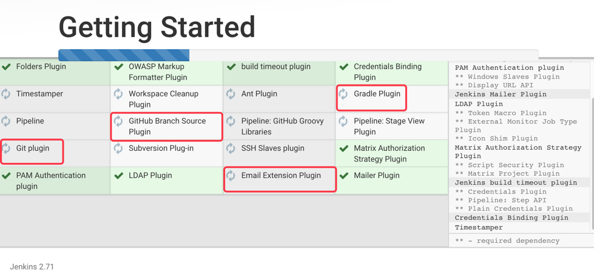
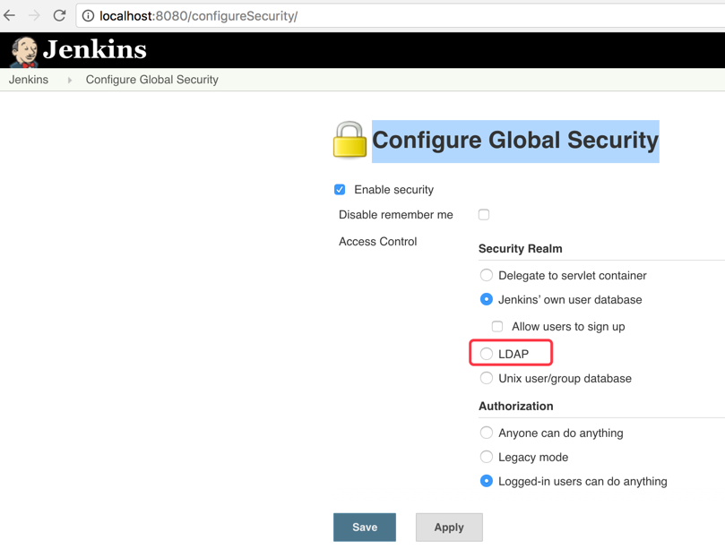
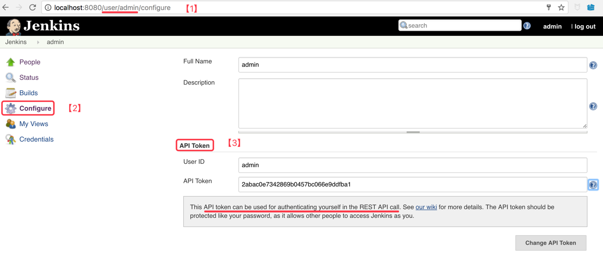
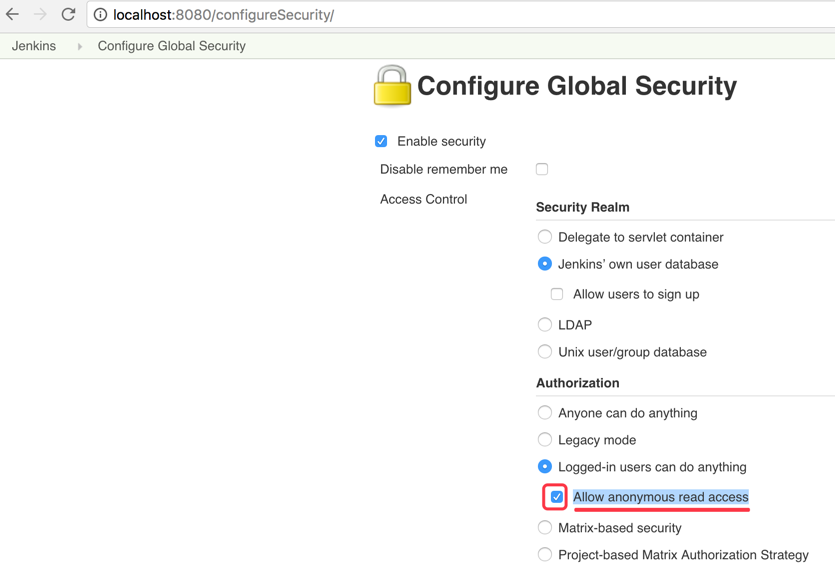

# jenkis概述与安装

<!-- TOC depthFrom:1 depthTo:6 withLinks:1 updateOnSave:1 orderedList:0 -->

- [jenkis概述与安装](#jenkis概述与安装)
	- [install](#install)
	- [初始化](#初始化)
	- [plugins](#plugins)
		- [官方推荐插件](#官方推荐插件)
		- [安装Locale插件](#安装locale插件)
	- [账号体系](#账号体系)
	- [调用 API](#调用-api)
	- [jenkins-cli](#jenkins-cli)
	- [认证方式](#认证方式)
		- [``API Token`` 形式](#api-token-形式)
		- [SSH Key 方式](#ssh-key-方式)
- [参考资料](#参考资料)

<!-- /TOC -->

## install

- on mac install

```
$ brew install jenkins
$ jenkins
```

浏览器访问 http://localhost:8080 进入配置页面。
数据存储目录：~/.jenkins  包括插件，日志和Jobs等。

## 初始化

- 第一次需 Unlock: ~/.jenkins/secrets/initialAdminPassword  系统把密码生成到这个文件，只有能访问这个文件的人才说明是管理员

- 设置代理：代理服务器，认证账号密码和 no_proxy 设置。

>如需重新初始化，请直接删除 ~/.jenkins 又可以重头开始配置。

## plugins

### 官方推荐插件

点击：系统管理>管理插件>可选插件

- git plugin （新版本或默认安装）
- Publish Over SSH / SSH Credentials Plugin
- Email Extension Plugin （邮件通知）



>下载插件的时候，往往需要用到代理（往往需海外代理）。可以在启动``jenkins``时，设置``http_proxy``环境变量。后期设置代理的路径是：系统管理>管理插件>高级
> Jenkins Plugin Center: https://updates.jenkins-ci.org/download/plugins/ 和 https://plugins.jenkins.io/

既然有插件，那就有生态：（1）插件仓库；（2）发布插件；（3）自动安装插件；（4）自动更新插件；（5）安装量/受欢迎程度统计；（6）Plugin之间的依赖管理。

### 安装Locale插件

安装完``jenkins``时，默认它的语言会跟浏览器设置的语言一致。但是为了跟国际接轨，我们尽可能强制用英文。需要下载``Locale``插件。

- 安装Locale插件

```
系统设置 (Manage Jenkins) -> 插件管理 (Manage Plugins) -> 可选插件 (Available)
然后搜索：Locale
```

- 设置为英文

```
http://localhost:8080/configure
Locale -> Default Language	-> en_US.UTF-8  或者 zh_CN.UTF-8
```

----

## 账号体系

``Jenkins`` 可以有自己的账号体系，也可以跟公司的域账号``LADP``集成。只需要在``Jenkins`` -> ``Configure Global Security``中设置：




## 调用 API

``Jenkins`` 支持``RESTful API``，但需要认证，难道我们模拟登陆？当然不是，现在主流的做法是用户通过界面登陆``Jenkins``的Web管理界面，然后通过界面生成一个``token``，后期调用只要携带这个``token``即可。本质上跟普通Web登陆，输入用户名+密码，然后服务端生成一个``session_id``，浏览器通过COOKIE来承载这个``session_id``是一样的。只不过两者的生命周期不一样而已。

生成 ``API Token``：
>- 点击 ``Jenkins`` -> ``People`` -> ``admin`` （选择进入``admin``账户，以便以``admin``账户的名义）
>- 在 [``admin``账户页面](http://localhost:8080/user/admin/) 的左侧栏，点击 ``Configure`` -> ``API Token`` 选项卡



## jenkins-cli

大家都知道``Jenkins``的界面是出了名的丑陋。但是作为一个后端程序员，有点想法，发明了一个``Jenkins``，前期找不到前端程序员合作，能搞出这样的界面也算是不容易了。当你不会做漂亮的界面，又想搞点事的时候，你怎么办呢？``RESTful API`` + ``cli`` 呀。

比如，我们直接通过命令行，查询``job``列表：

``` bash
$ jenkins-cli -s  http://localhost:8080/ list-jobs
java.io.IOException: Server returned HTTP response code: 403 for URL: http://localhost:8080/jenkins/cli?remoting=false
	at sun.net.www.protocol.http.HttpURLConnection.getInputStream0(HttpURLConnection.java:1840)
	at sun.net.www.protocol.http.HttpURLConnection.getInputStream(HttpURLConnection.java:1441)
	at hudson.cli.FullDuplexHttpStream.<init>(FullDuplexHttpStream.java:99)
	at hudson.cli.CLI.plainHttpConnection(CLI.java:652)
	at hudson.cli.CLI._main(CLI.java:612)
	at hudson.cli.CLI.main(CLI.java:426)

$ export JENKINS_URL=http://localhost:8080/

$ jenkins-cli list-jobs
java.io.IOException: Server returned HTTP response code: 403 for URL: http://localhost:8080/jenkins/cli?remoting=false

$ jenkins-cli -auth admin:e6c630e01fce4191a2be2b602ca69874 list-jobs
hello-world-jresty

```

其中：

>- ``-s``选项：  表示服务器地址。如果我们不想每次命令都输入，可以保存到 ``$JENKINS_URL`` 环境变量中。
>- API地址：JENKINS_URL=http://localhost:8080/  而不是有些教程里面的 JENKINS_URL=http://localhost:8080/jenkins/  (本教程jenkins版本是 2.73)
> - 账号密码：通过``-auth admin:e6c630e01fce4191a2be2b602ca69874``指定账号和密码。
> - 帮助信息：在Web页面上，点击 ``jenkins`` -> ``Manage Jenkins`` -> ``Jenkins-Cli``，也就是 http://localhost:8080/cli/ 会有帮助信息。


## 认证方式

除了上文直接输入Web页面一样的用户名+密码的方式（这种用在``RESTful API``上，实质表现为``HTTP Basic Auth``形式），它还支持：``API token``认证 和  ``SSH Key`` 方式。

### ``API Token`` 形式

按前文说的步骤，生成 ``API Token``：
>- 点击 ``Jenkins`` -> ``People`` -> ``admin`` （选择进入``admin``账户，以便以``admin``账户的名义）
>- 在 [``admin``账户页面](http://localhost:8080/user/admin/) 的左侧栏，点击 ``Configure`` -> ``API Token`` 选项卡

``` bash
$ jenkins-cli -auth admin:f69552d7a187b8a8944ab3f88b38ad76 list-jobs

hello-world-jresty
```

注意：形式跟账号密码是一样的？对！官方帮助是这么写的：
>``-auth [ USER:SECRET | @FILE ] : specify username and either password or API token (or load from them both from a file);``

也可以把账号+API Token保存到文件，然后：

``` bash
$ echo "admin:f69552d7a187b8a8944ab3f88b38ad76" > token.txt
$ jenkins-cli -auth @token.txt list-jobs
hello-world-jresty
```

### SSH Key 方式

``Jenkins``可以类似``github.com``一样，支持``SSH Key``方式认证：1）在本地生成秘钥对：``~/.ssh/id_rsa``和``~/.ssh/id_rsa.pub``；2) 把``~/.ssh/id_rsa.pub``粘贴到``Jenkins`` Web

按下列步骤填写SSH Public Key: http://localhost:8080/me/configure
>- 点击 ``Jenkins`` -> ``People`` -> ``admin`` （选择进入``admin``账户，以便以``admin``账户的名义）
>- 在 [``admin``账户页面](http://localhost:8080/user/admin/) 的左侧栏，点击 ``Configure`` -> ``		
SSH Public Keys`` 选项卡


接着直接使用命令行，它自己会用``~/.ssh/id_rsa``去签名的：

``` bash
$ jenkins-cli list-jobs

ERROR: anonymous is missing the Overall/Read permission

$ jenkins-cli -i ~/.ssh/id_rsa list-jobs

ERROR: anonymous is missing the Overall/Read permission
```

报错了，我们还需要在服务端 [Configure Global Security](http://localhost:8080/configureSecurity/) 打开一个选项开关。如下图勾选上 ``Allow anonymous read access``即可：




``` bash
$ jenkins-cli list-jobs

hello-world-jresty
```

# 参考资料

- [complete-guide-to-use-jenkins-cli-command-line](http://www.scmgalaxy.com/tutorials/complete-guide-to-use-jenkins-cli-command-line)
- [User Is Missing The Overall/read Permission Jenkins](http://savecomputer.net/is-missing/user-is-missing-the-overall-read-permission-jenkins.html)
- [官方Jenkins-CLI文档](https://wiki.jenkins.io/display/JENKINS/Jenkins+CLI)
