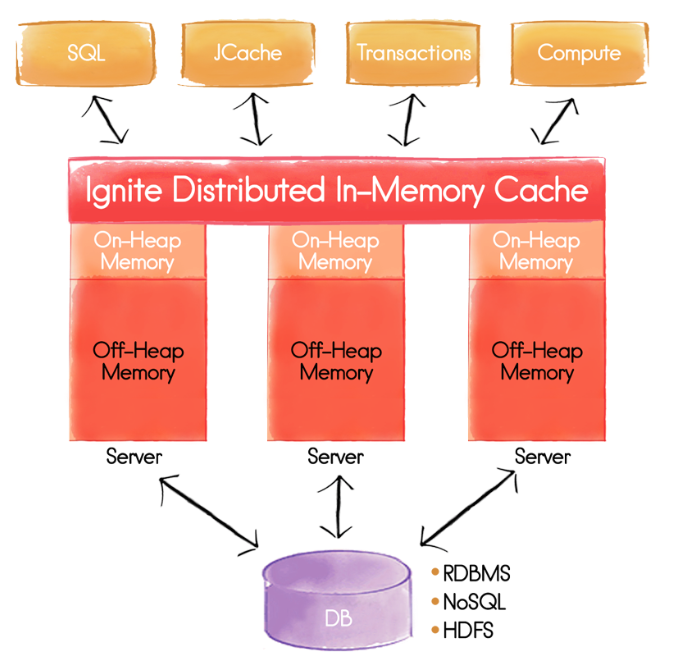

# 分布式缓存：In-memory Data Grid

- 老牌的： ``memcached``
- 当红一哥：  ``redis``
- 投行金融领域的： ``Gemfire`` （12306网站也用）
- 新秀： Apache ``Ignite``
- Oracle的: ``Coherence``

## Ignite

### 支持JCache标准 （JSR107）

Ignite 100%兼容于JCache（JSR107）规范，JCache为数据缓存提供了非常简单，但是功能又非常强大的API。
JCache的一部分API包括：

- 基本缓存操作
- ConcurrentMap APIs
- 并置处理（EntryProcessor）
- 事件和度量
- 可插拔的**持久化**

### 分区和复制

根据配置，Ignite可以对内存内的数据进行分区或者复制。和REPLICATED模式不同，数据是在集群内的所有节点中全复制的，在PARTITIONED模式中，数据是在集群内的多个节点中平均拆分的，允许在内存内缓存TB级的数据。

Ignite也可以配置成具有多个副本，来保证故障时的数据弹性。

## 12306与``Gemfire``

中国铁路客户服务中心网站www.12306.cn是世界规模最大的实时交易系统之一，媲美Amazon.com，节假日尤其是春节的访问高峰，网站压力巨大。2012年6月选择了Pivotal GemFire分布式内存计算平台（Distributed In-memory computing）改造12306，由铁科院项目小组负责人王明哲主任和资拓宏宇（IISI）信息科技有限公司在铁科院主管朱建生所长领导下提供技术实施。

# 参考资料

- [Apache Ignite简介以及和Coherence、Gemfire、Redis等的比较](http://www.tuicool.com/articles/ziUfmaj)

- [Apache Ignite 中文翻译](https://www.zybuluo.com/liyuj/note/230739)

- [基准测试：Apache Ignite仍然领先于Hazelcast](https://my.oschina.net/liyuj/blog/899359)

- [通过Redis协议访问Apache Ignite](https://my.oschina.net/liyuj/blog/830316)

- [在Ignite上运行微服务：第一部分](https://my.oschina.net/liyuj/blog/806752)
